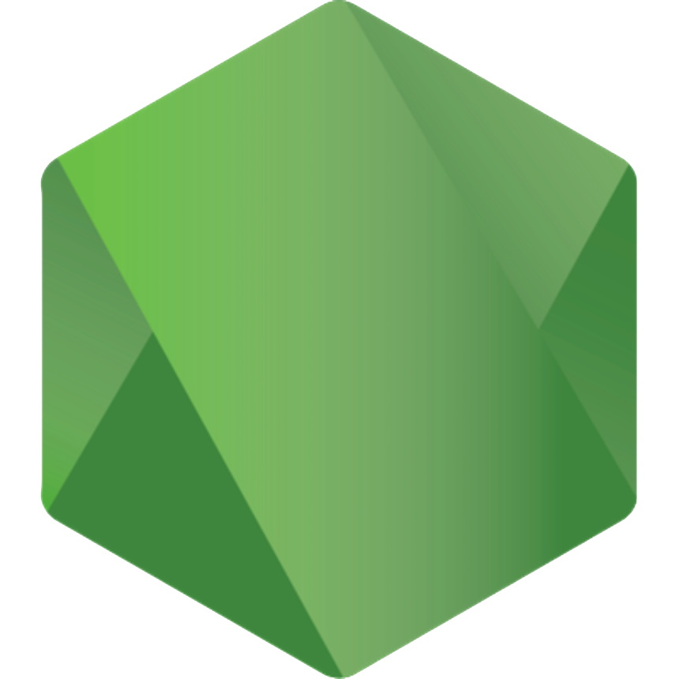

### ```{```
### ```    "name": "Aqeel",```
### ```    "role": "Full Stack Developer 👨‍💻"```
### ```}```
<br/>

### ```{ "Connect with me" : [```

[][linkedin]

[][stackoverflow]

[][instagram]
<br/>
### ```]}```

### ```{ "Languages & Tools" : [```
[][aqeelshamz]
[][aqeelshamz]
[][aqeelshamz]
[][aqeelshamz]
[][aqeelshamz]
[][aqeelshamz]
[][aqeelshamz]
[][aqeelshamz]
[][aqeelshamz]
<br/>
### ```]}```

[instagram]: https://www.instagram.com/aqeelshamz/
[stackoverflow]: https://stackoverflow.com/users/11350679/aqeel/
[aqeelshamz]: https://github.com/aqeelshamz
[buymeacoffee]: https://www.buymeacoffee.com/aqeelshamz
[envato]: https://codecanyon.net/user/aqeelshamz/portfolio
[linkedin]: https://www.linkedin.com/in/aqeelshamz/
